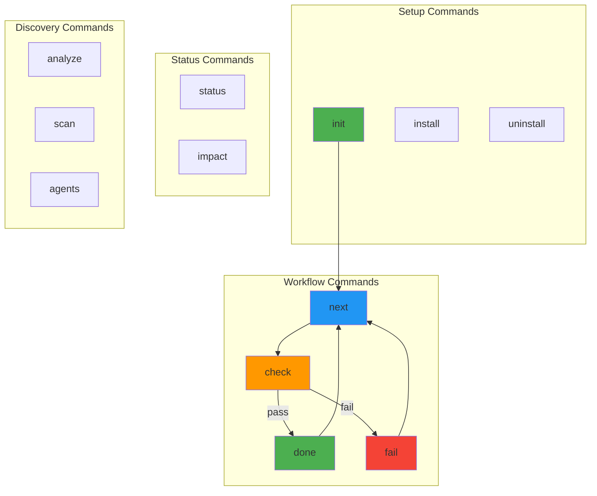
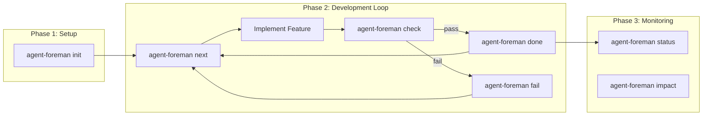
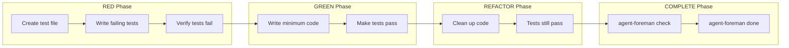

# Agent Foreman CLI Commands

Complete reference documentation for all agent-foreman CLI commands.

> agent-foreman CLI 所有命令的完整参考文档。

## Command Overview



## Commands by Category

### Setup Commands

| Command | Description |
|---------|-------------|
| [init](./init.md) | Initialize or upgrade the long-task harness |
| [install](./install.md) | Install Claude Code plugin |
| [uninstall](./uninstall.md) | Remove Claude Code plugin |

### Core Workflow Commands

| Command | Description |
|---------|-------------|
| [next](./next.md) | Show next feature to work on with TDD guidance |
| [check](./check.md) | AI-powered verification of feature completion |
| [done](./done.md) | Mark feature as complete with auto-commit |
| [fail](./fail.md) | Mark feature as failed and continue to next |

### Status & Analysis Commands

| Command | Description |
|---------|-------------|
| [status](./status.md) | Show current harness status |
| [impact](./impact.md) | Analyze impact of changes to a feature |

### Discovery Commands

| Command | Description |
|---------|-------------|
| [analyze](./analyze.md) | Generate AI-powered project analysis report |
| [scan](./scan.md) | Detect project verification capabilities |
| [agents](./agents.md) | Show available AI agents status |

## Standard Workflow



### Recommended Workflow Steps

1. **Initialize**: `agent-foreman init` - Set up the harness
2. **Get Task**: `agent-foreman next` - View next feature
3. **Implement**: Write code to satisfy acceptance criteria
4. **Verify**: `agent-foreman check <feature_id>` - Verify implementation
5. **Complete**: `agent-foreman done <feature_id>` - Mark as complete
6. **Repeat**: Go back to step 2

## TDD Workflow (Strict Mode)



## Quick Reference

### Most Common Commands

```bash
# Initialize harness
agent-foreman init

# Get next feature
agent-foreman next

# Verify feature
agent-foreman check <feature_id>

# Complete feature (if check passes)
agent-foreman done <feature_id>

# Mark failed (if check fails, continue to next)
agent-foreman fail <feature_id> --reason "..."

# View status
agent-foreman status
```

### Output Modes

Most commands support multiple output modes:

| Flag | Description |
|------|-------------|
| (default) | Human-readable formatted output |
| `--json` | Machine-readable JSON output |
| `--quiet` | Minimal output |

### Common Options

| Option | Description |
|--------|-------------|
| `-v, --verbose` | Show detailed output |
| `--help` | Show command help |

## Data Files

Commands interact with these files in the `ai/` directory:

| File | Purpose | Commands |
|------|---------|----------|
| `ai/feature_list.json` | Feature backlog | All workflow commands |
| `ai/progress.log` | Activity log | next, check, done, fail, status |
| `ai/capabilities.json` | Tool detection cache | scan, check, done |
| `ai/init.sh` | Bootstrap script | init |

## Exit Codes

| Code | Meaning |
|------|---------|
| 0 | Success |
| 1 | Error (missing feature list, feature not found, verification failed) |

## Environment Variables

| Variable | Default | Description |
|----------|---------|-------------|
| `AGENT_FOREMAN_AGENTS` | `claude,codex,gemini` | AI agent priority order |

## See Also

- [USAGE.md](../USAGE.md) - Detailed usage guide
- [ARCHITECTURE.md](../ARCHITECTURE.md) - Project architecture
- [TECH.md](../TECH.md) - Technical details
