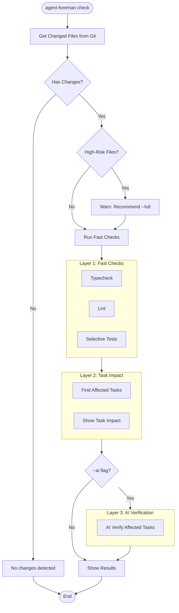
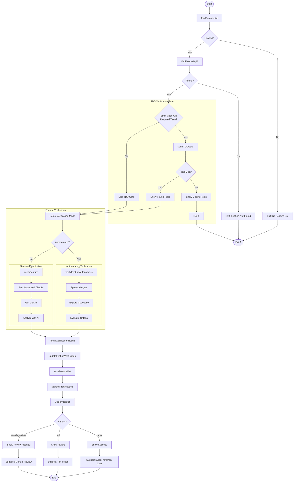
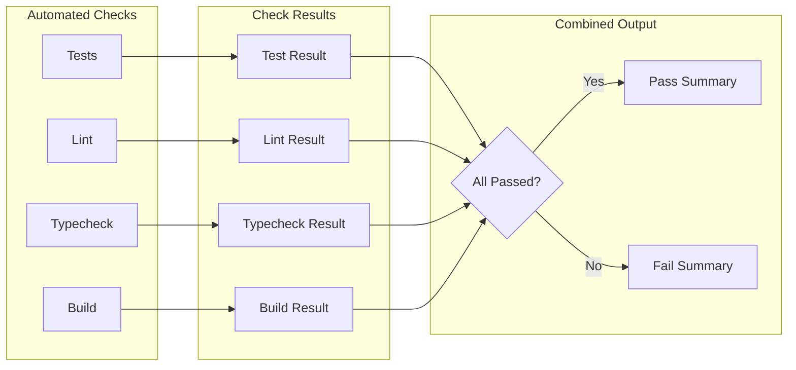
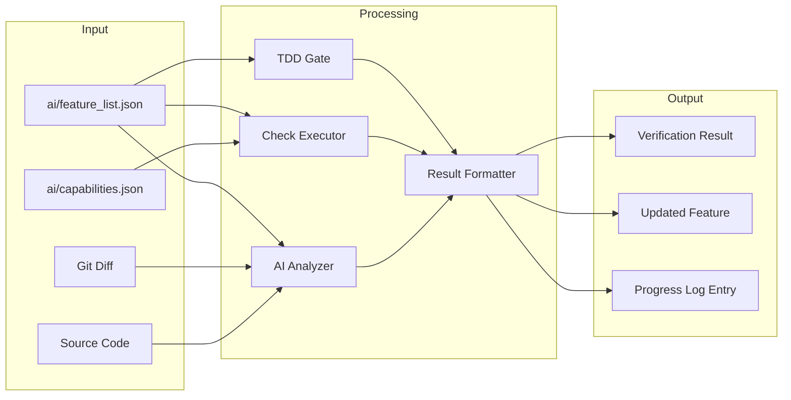

# check Command

AI-powered verification of feature completion against acceptance criteria.

> AI 驱动的功能完成验证，对照验收标准检查。

## Synopsis

```bash
# Fast check mode (default - no feature_id)
agent-foreman check [options]

# Task-based full verification
agent-foreman check <feature_id> [options]

# Full verification with auto-select
agent-foreman check --full [options]
```

## Description

The `check` command has three modes:

1. **Fast Check Mode** (default, no feature_id): Git diff-based verification with selective tests and task impact notification. Skips build and E2E tests for speed.

2. **Task-Based Verification** (with feature_id): Full verification of a specific task including all tests, build, and AI analysis.

3. **Full Verification with Auto-Select** (`--full` without feature_id): Automatically selects the next pending task and runs full verification.

**Important**: This command verifies but does NOT mark the feature as complete - use `done` for that.

> `check` 命令有三种模式：
> 1. **快速检查模式**（默认，无 feature_id）：基于 Git diff 的验证，包含选择性测试和任务影响通知。跳过构建和 E2E 测试以提高速度。
> 2. **基于任务的验证**（有 feature_id）：对特定任务进行完整验证，包括所有测试、构建和 AI 分析。
> 3. **全量验证自动选择**（`--full` 无 feature_id）：自动选择下一个待处理任务并运行完整验证。

## Arguments

| Argument | Required | Description |
|----------|----------|-------------|
| `feature_id` | No | The feature to verify. Omit for fast check mode, or use `--full` to auto-select |

## Options

| Option | Alias | Default | Description |
|--------|-------|---------|-------------|
| `--verbose` | `-v` | `false` | Show detailed output |
| `--full` | - | `false` | Run full verification (all tests + build + E2E). Auto-selects next task if no feature_id |
| `--ai` | - | `false` | Run AI verification for affected tasks (fast check mode only) |
| `--skip-checks` | `-s` | `false` | Skip automated checks (AI only) |
| `--no-autonomous` | - | `false` | Disable autonomous AI exploration |
| `--quick` | - | `true` | Run only related tests (for task mode) |
| `--test-pattern` | - | - | Explicit test pattern |
| `--skip-e2e` | - | `false` | Skip E2E tests entirely |

## Execution Flow

### Fast Check Mode (No Feature ID)



### Task-Based Verification (With Feature ID)



## Verification Modes

### Fast Check Mode (Default)

When called without a feature_id:
1. Gets changed files from git diff
2. Detects high-risk changes (package.json, tsconfig.json, etc.)
3. Runs selective tests based on changed files
4. Runs typecheck and lint (skips build)
5. Shows task impact notification (affected tasks)
6. Optionally runs AI verification with `--ai` flag

### Task-Based Verification

When called with a feature_id:
1. Run automated checks (tests, lint, typecheck, build)
2. Get git diff of uncommitted changes
3. Send diff + acceptance criteria to AI
4. AI evaluates each criterion

### Autonomous Mode

1. Build exploration prompt with acceptance criteria
2. Spawn AI agent with full codebase access
3. Agent autonomously explores code
4. Agent evaluates each criterion and provides verdict

### TDD Mode (Strict)

1. **Gate Check**: Verify test files exist
2. Run tests matching feature patterns
3. Tests must pass for feature to pass

## Automated Checks Flow



### Check Execution Order
1. **Tests** - Run project test suite (or selective tests in quick mode)
2. **Lint** - Run linter if configured
3. **Typecheck** - Run TypeScript check if configured
4. **Build** - Run build if configured (skipped in fast check mode)

### Fast Check vs Full Mode

| Mode | Tests | Typecheck | Lint | Build | E2E | Task Impact | AI |
|------|-------|-----------|------|-------|-----|-------------|-----|
| Fast (default) | Selective | Yes | Yes | No | No | Yes | Optional (--ai) |
| Full (--full) | All | Yes | Yes | Yes | Yes | No | Yes |
| Task-based | Pattern | Yes | Yes | Yes | Optional | No | Yes |

## High-Risk File Detection

Fast check mode warns when these files are changed:
- `package.json`, `package-lock.json`, `pnpm-lock.yaml`, `yarn.lock`
- `tsconfig*.json`
- `.eslintrc*`, `eslint.config.*`
- `vite.config.*`, `vitest.config.*`, `playwright.config.*`
- `.env*`
- `Cargo.toml`, `go.mod`, `requirements.txt`

When high-risk files are detected, the command suggests using `--full` mode.

## Data Flow Diagram



## Verification Result Schema

```typescript
interface VerificationResult {
  verdict: 'pass' | 'fail' | 'needs_review';
  criteriaResults: {
    criterion: string;
    verdict: 'pass' | 'fail' | 'uncertain';
    evidence: string;
    reasoning?: string;
  }[];
  automatedChecks: {
    tests?: { passed: boolean; output?: string };
    lint?: { passed: boolean; output?: string };
    typecheck?: { passed: boolean; output?: string };
    build?: { passed: boolean; output?: string };
  };
  aiAnalysis?: {
    summary: string;
    confidence: number;
    suggestions?: string[];
  };
}
```

## Dependencies

### Internal Modules
- `src/feature-list.ts` - Feature operations
- `src/progress-log.ts` - Progress tracking
- `src/test-gate.ts` - TDD verification gate
- `src/verifier/index.ts` - Verification orchestration
  - `verifyFeature()` - Standard verification
  - `verifyFeatureAutonomous()` - Autonomous verification
  - `createVerificationSummary()` - Result summary
  - `formatVerificationResult()` - Display formatting
- `src/verifier/layered-check.ts` - Fast check mode
  - `runLayeredCheck()` - Fast verification
  - `isHighRiskChange()` - High-risk file detection
- `src/verifier/task-impact.ts` - Task impact detection
  - `getTaskImpact()` - Map files to affected tasks

### External Dependencies
- `chalk` - Console output styling
- AI CLI tools for autonomous verification

## Files Read

| File | Purpose |
|------|---------|
| `ai/feature_list.json` | Feature details and criteria |
| `ai/capabilities.json` | Test/lint/typecheck commands |
| Git working directory | Code changes for analysis |

## Files Written

| File | Purpose |
|------|---------|
| `ai/feature_list.json` | Update verification summary |
| `ai/progress.log` | Append VERIFY entry |

## Exit Codes

| Code | Meaning |
|------|---------|
| 0 | Verification completed (any verdict) |
| 1 | Feature not found / No feature list / TDD gate failed |

## Examples

### Fast Check (Default)
```bash
# Quick verification of current changes
agent-foreman check

# Fast check with AI verification for affected tasks
agent-foreman check --ai

# Fast check with verbose output
agent-foreman check -v
```

### Full Verification
```bash
# Full verification, auto-select next task
agent-foreman check --full

# Full verification of specific task
agent-foreman check auth.login
```

### Task-Based Verification
```bash
# Verify specific feature
agent-foreman check auth.login

# Verbose output
agent-foreman check auth.login -v

# Skip automated checks (AI only)
agent-foreman check auth.login --skip-checks

# Skip E2E tests
agent-foreman check auth.login --skip-e2e

# Custom test pattern
agent-foreman check auth.login --test-pattern "tests/auth/**/*.test.ts"
```

## Console Output Example

### Fast Check Mode
```
╭─ ⚡ FAST CHECK ──────────────────────────────────────╮
│ Changed: 3 files
│ Skipped: AI analysis, build, e2e                     │
│                                                      │
│ ✓ typecheck    passed (2.1s)
│ ✓ lint         passed (0.8s)
│ ✓ tests        passed (3.5s) [2 files]
│                                                      │
│ ⚡ FAST CHECK PASSED (6.4s)
╰──────────────────────────────────────────────────────╯

ℹ TASK IMPACT:
  These changes may affect:
    • auth.login
      matches affectedBy pattern: src/auth/**/*

  To verify acceptance criteria:
  $ agent-foreman check --ai
```

### Fast Check with High-Risk Warning
```
╭─ ⚡ FAST CHECK ──────────────────────────────────────╮
│ Changed: 5 files
│ ⚠ High-risk files changed (config/deps)              │
│   Recommend: agent-foreman check --full              │
```

### TDD Gate (Strict Mode)
```
═══════════════════════════════════════════════════════════════
                    TDD VERIFICATION GATE
═══════════════════════════════════════════════════════════════

   Mode: STRICT TDD (tests required by project configuration)
   ✓ Test files exist
     Found: tests/auth/login.test.ts, tests/auth/login.integration.test.ts
```

### Verification Result (Pass)
```
═══════════════════════════════════════════════════════════════
                    FEATURE VERIFICATION
═══════════════════════════════════════════════════════════════

📋 Feature: auth.login
   Module: auth | Priority: 1

📝 Acceptance Criteria:
   1. User can login with valid credentials
   2. Error message displays for invalid credentials
   3. Session token is stored in localStorage

🔍 Verification Results:

   Automated Checks:
   ✓ Tests: PASSED (15/15 tests)
   ✓ Lint: PASSED (no issues)
   ✓ Typecheck: PASSED (no errors)
   ✓ Build: PASSED

   AI Analysis:
   ✓ Criterion 1: PASS
     Evidence: Login endpoint returns 200 with valid credentials
   ✓ Criterion 2: PASS
     Evidence: Error component renders with message from API
   ✓ Criterion 3: PASS
     Evidence: useAuth hook saves token to localStorage

   Overall: PASS (confidence: 95%)

   Results saved to ai/verification/results.json
   Feature list updated with verification summary

   ✓ Task verified successfully!
   Run 'agent-foreman done auth.login' to mark as passing
```

### Verification Result (Fail)
```
   AI Analysis:
   ✓ Criterion 1: PASS
     Evidence: Login endpoint implemented correctly
   ✗ Criterion 2: FAIL
     Evidence: Error message not displayed, only console.log
   ✓ Criterion 3: PASS
     Evidence: Token saved to localStorage

   Overall: FAIL

   ✗ Verification failed. Review the criteria above and fix issues.

   Options:
   1. Fix issues and run 'agent-foreman check auth.login' again
   2. Mark as failed: 'agent-foreman fail auth.login -r "reason"'
```

### TDD Gate Failure
```
═══════════════════════════════════════════════════════════════
                    TDD VERIFICATION GATE
═══════════════════════════════════════════════════════════════

   Mode: STRICT TDD (tests required by project configuration)

   ✗ TDD GATE FAILED: Required test files are missing

   Missing Unit Tests:
     • tests/auth/**/*.test.ts

   TDD Workflow Required:
   1. Create test file(s) matching the pattern(s) above
   2. Write failing tests for acceptance criteria
   3. Implement the feature to make tests pass
   4. Run 'agent-foreman check auth.login' again

   Run 'agent-foreman next auth.login' for TDD guidance
```

## Verdict Meanings

| Verdict | Meaning | Action |
|---------|---------|--------|
| `pass` | All criteria met | Run `done` to complete |
| `fail` | One or more criteria not met | Fix issues and re-check |
| `needs_review` | Uncertain about some criteria | Manual review required |

## Related Commands

- `agent-foreman next` - Get feature details and TDD guidance
- `agent-foreman done` - Mark feature as complete
- `agent-foreman scan` - Refresh capability detection
- `agent-foreman fail` - Mark feature as failed
