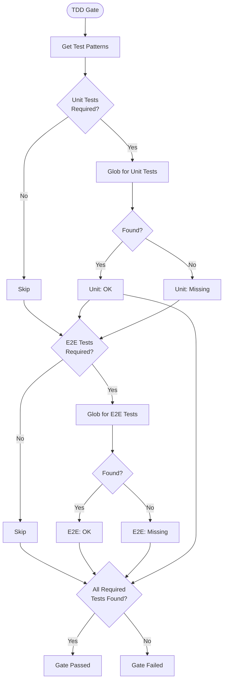
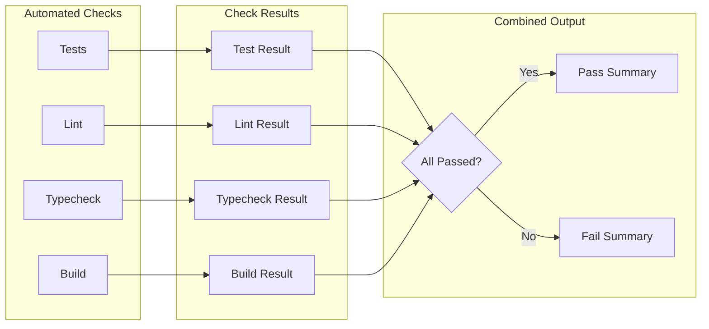
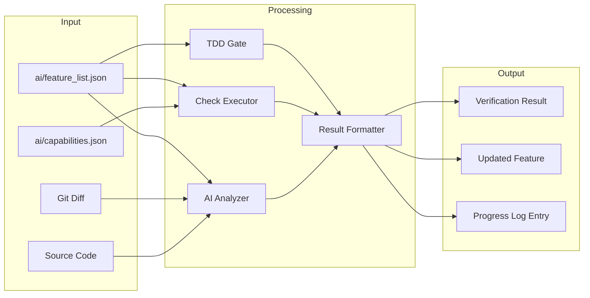

# check Command

AI-powered verification of feature completion against acceptance criteria.

> AI 驱动的功能完成验证，对照验收标准检查。

## Synopsis

```bash
agent-foreman check <feature_id> [options]
```

## Description

The `check` command verifies that a feature implementation meets its acceptance criteria. It runs automated checks (tests, lint, typecheck, build) and uses AI analysis to evaluate completion. **Important**: This command verifies but does NOT mark the feature as complete - use `done` for that.

> `check` 命令验证功能实现是否满足其验收标准。它运行自动化检查（测试、lint、类型检查、构建）并使用 AI 分析来评估完成情况。**重要**：此命令仅验证但不会将功能标记为完成 - 使用 `done` 命令完成该操作。

## Arguments

| Argument | Required | Description |
|----------|----------|-------------|
| `feature_id` | Yes | The feature to verify |

## Options

| Option | Alias | Default | Description |
|--------|-------|---------|-------------|
| `--verbose` | `-v` | `false` | Show detailed AI reasoning |
| `--skip-checks` | `-s` | `false` | Skip automated checks (AI only) |
| `--no-autonomous` | - | Use diff-based | Use diff-based analysis instead of autonomous exploration |
| `--quick` | `-q` | `true` | Run only related tests |
| `--full` | - | `false` | Force full test suite |
| `--test-pattern` | - | - | Explicit test pattern |
| `--skip-e2e` | - | `false` | Skip E2E tests (unit tests only) |

## Execution Flow


## Verification Modes

```mermaid
flowchart TD
    subgraph Standard["Standard Mode (default)"]
        S1[Run Automated Checks] --> S2[Get Git Diff]
        S2 --> S3[Build AI Prompt with Diff]
        S3 --> S4[AI Analyzes Changes]
    end

    subgraph Autonomous["Autonomous Mode (--no-autonomous=false)"]
        A1[Build Exploration Prompt] --> A2[Spawn AI Agent]
        A2 --> A3[Agent Explores Codebase]
        A3 --> A4[Agent Evaluates Criteria]
    end

    subgraph TDD["TDD Mode (strict tddMode)"]
        T1[Verify Test Files Exist] --> T2[Run Tests Only]
        T2 --> T3[Evaluate Test Results]
    end
```



### Standard Mode (Default)
1. Run automated checks (tests, lint, typecheck, build)
2. Get git diff of uncommitted changes
3. Send diff + acceptance criteria to AI
4. AI evaluates each criterion

### Autonomous Mode
1. Build exploration prompt with acceptance criteria
2. Spawn AI agent with full codebase access
3. Agent autonomously explores code
4. Agent evaluates each criterion and provides verdict

### TDD Mode (Strict)
1. **Gate Check**: Verify test files exist
2. Run tests matching feature patterns
3. Tests must pass for feature to pass

## TDD Gate Detail



## Automated Checks Flow



### Check Execution Order
1. **Tests** - Run project test suite (or selective tests in quick mode)
2. **Lint** - Run linter if configured
3. **Typecheck** - Run TypeScript check if configured
4. **Build** - Run build if configured

### Quick vs Full Mode

| Mode | Behavior |
|------|----------|
| Quick (default) | Run tests matching `testRequirements.unit.pattern` |
| Full | Run entire test suite |

## Data Flow Diagram



## Verification Result Schema

```typescript
interface VerificationResult {
  verdict: 'pass' | 'fail' | 'needs_review';
  criteriaResults: {
    criterion: string;
    verdict: 'pass' | 'fail' | 'uncertain';
    evidence: string;
    reasoning?: string;
  }[];
  automatedChecks: {
    tests?: { passed: boolean; output?: string };
    lint?: { passed: boolean; output?: string };
    typecheck?: { passed: boolean; output?: string };
    build?: { passed: boolean; output?: string };
  };
  aiAnalysis?: {
    summary: string;
    confidence: number;
    suggestions?: string[];
  };
}
```

## Dependencies

### Internal Modules
- `src/feature-list.ts` - Feature operations
- `src/progress-log.ts` - Progress tracking
- `src/test-gate.ts` - TDD verification gate
- `src/verifier/index.ts` - Verification orchestration
  - `verifyFeature()` - Standard verification
  - `verifyFeatureAutonomous()` - Autonomous verification
  - `createVerificationSummary()` - Result summary
  - `formatVerificationResult()` - Display formatting

### External Dependencies
- `chalk` - Console output styling
- AI CLI tools for autonomous verification

## Files Read

| File | Purpose |
|------|---------|
| `ai/feature_list.json` | Feature details and criteria |
| `ai/capabilities.json` | Test/lint/typecheck commands |
| Git working directory | Code changes for analysis |

## Files Written

| File | Purpose |
|------|---------|
| `ai/feature_list.json` | Update verification summary |
| `ai/progress.log` | Append VERIFY entry |

## Exit Codes

| Code | Meaning |
|------|---------|
| 0 | Verification completed (any verdict) |
| 1 | Feature not found / No feature list / TDD gate failed |

## Examples

### Basic Verification
```bash
# Verify feature implementation
agent-foreman check auth.login
```

### Quick Mode (Default)
```bash
# Run only related tests
agent-foreman check auth.login --quick
```

### Full Test Suite
```bash
# Run all tests
agent-foreman check auth.login --full
```

### Verbose Output
```bash
# Show detailed AI reasoning
agent-foreman check auth.login -v
```

### Skip Automated Checks
```bash
# AI analysis only
agent-foreman check auth.login --skip-checks
```

### Skip E2E Tests
```bash
# Unit tests only
agent-foreman check auth.login --skip-e2e
```

### Custom Test Pattern
```bash
# Specific test files
agent-foreman check auth.login --test-pattern "tests/auth/**/*.test.ts"
```

## Console Output Example

### TDD Gate (Strict Mode)
```
═══════════════════════════════════════════════════════════════
                    TDD VERIFICATION GATE
═══════════════════════════════════════════════════════════════

   Mode: STRICT TDD (tests required by project configuration)
   ✓ Test files exist
     Found: tests/auth/login.test.ts, tests/auth/login.integration.test.ts
```

### Verification Result (Pass)
```
═══════════════════════════════════════════════════════════════
                    FEATURE VERIFICATION
═══════════════════════════════════════════════════════════════

📋 Feature: auth.login
   Module: auth | Priority: 1

📝 Acceptance Criteria:
   1. User can login with valid credentials
   2. Error message displays for invalid credentials
   3. Session token is stored in localStorage

🔍 Verification Results:

   Automated Checks:
   ✓ Tests: PASSED (15/15 tests)
   ✓ Lint: PASSED (no issues)
   ✓ Typecheck: PASSED (no errors)
   ✓ Build: PASSED

   AI Analysis:
   ✓ Criterion 1: PASS
     Evidence: Login endpoint returns 200 with valid credentials
   ✓ Criterion 2: PASS
     Evidence: Error component renders with message from API
   ✓ Criterion 3: PASS
     Evidence: useAuth hook saves token to localStorage

   Overall: PASS (confidence: 95%)

   Results saved to ai/verification/results.json
   Feature list updated with verification summary

   ✓ Feature verified successfully!
   Run 'agent-foreman done auth.login' to mark as passing
```

### Verification Result (Fail)
```
   AI Analysis:
   ✓ Criterion 1: PASS
     Evidence: Login endpoint implemented correctly
   ✗ Criterion 2: FAIL
     Evidence: Error message not displayed, only console.log
   ✓ Criterion 3: PASS
     Evidence: Token saved to localStorage

   Overall: FAIL

   ✗ Verification failed. Review the criteria above and fix issues.
```

### TDD Gate Failure
```
═══════════════════════════════════════════════════════════════
                    TDD VERIFICATION GATE
═══════════════════════════════════════════════════════════════

   Mode: STRICT TDD (tests required by project configuration)

   ✗ TDD GATE FAILED: Required test files are missing

   Missing Unit Tests:
     • tests/auth/**/*.test.ts

   TDD Workflow Required:
   1. Create test file(s) matching the pattern(s) above
   2. Write failing tests for acceptance criteria
   3. Implement the feature to make tests pass
   4. Run 'agent-foreman check auth.login' again

   Run 'agent-foreman next auth.login' for TDD guidance
```

## Verdict Meanings

| Verdict | Meaning | Action |
|---------|---------|--------|
| `pass` | All criteria met | Run `done` to complete |
| `fail` | One or more criteria not met | Fix issues and re-check |
| `needs_review` | Uncertain about some criteria | Manual review required |

## Related Commands

- `agent-foreman next` - Get feature details and TDD guidance
- `agent-foreman done` - Mark feature as complete
- `agent-foreman scan` - Refresh capability detection
