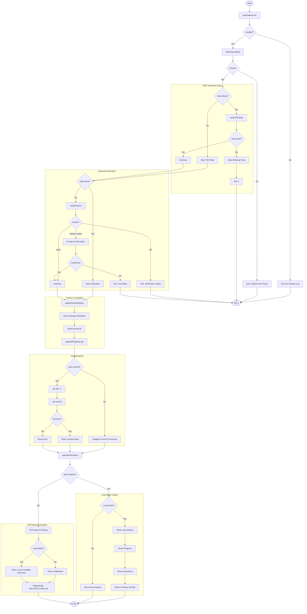
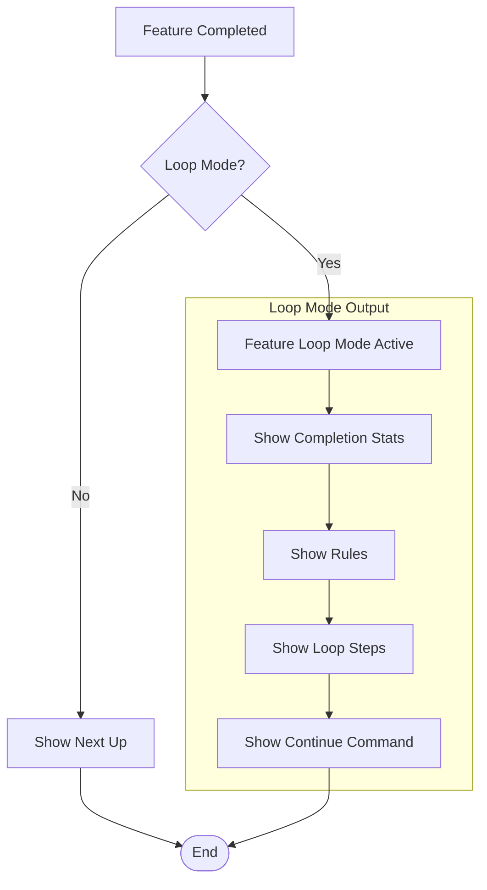
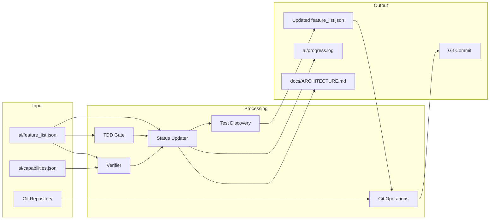
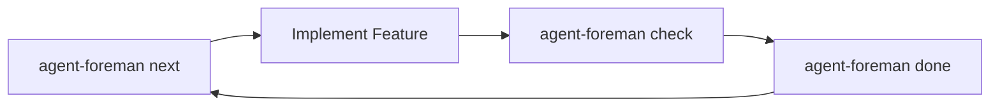

# done Command

Verify and mark a feature as complete with auto-commit and loop mode support.

> 验证并将功能标记为完成，支持自动提交和循环模式。

## Synopsis

```bash
agent-foreman done <feature_id> [options]
```

## Description

The `done` command completes the feature workflow: optionally verifies the implementation, updates the feature status to `passing`, auto-commits changes, and suggests the next feature. It's designed for both human developers and AI agents with loop mode for autonomous processing.

> `done` 命令完成功能工作流：可选地验证实现、将功能状态更新为 `passing`、自动提交更改，并建议下一个功能。它专为人类开发者和 AI 代理设计，支持自主处理的循环模式。

## Important: Verification Behavior

**By default, `done` skips verification** (`--skip-check=true`). This is intentional:

> **重要：默认情况下，`done` 命令跳过验证**（`--skip-check=true`）。这是有意设计的：

| Workflow | Commands | Description |
|----------|----------|-------------|
| **Recommended** | `check` → `done` | Verify first, then complete (skips re-verification) |
| **Alternative** | `done --no-skip-check` | Verify and complete in one step |
| **Trust mode** | `done` | Skip verification entirely (for manual review) |

The flag name `--skip-check` with `--no-skip-check` to enable verification can be confusing. Think of it as:
- `done` = "I already verified, just mark complete"
- `done --no-skip-check` = "Verify for me, then mark complete"

## Arguments

| Argument | Required | Description |
|----------|----------|-------------|
| `feature_id` | Yes | The feature to mark as complete |

## Options

| Option | Alias | Default | Description |
|--------|-------|---------|-------------|
| `--notes` | `-n` | - | Additional notes to add |
| `--no-commit` | - | `false` | Skip automatic git commit |
| `--skip-check` | - | `true` | Skip verification (use `--no-skip-check` to verify) |
| `--verbose` | `-v` | `false` | Show detailed output |
| `--no-autonomous` | - | - | Use diff-based instead of autonomous exploration |
| `--quick` | `-q` | `true` | Run selective tests only |
| `--full` | - | `false` | Force full test suite |
| `--test-pattern` | - | - | Explicit test pattern |
| `--skip-e2e` | - | `false` | Skip E2E tests |
| `--loop` | - | `true` | Enable loop mode |

## Execution Flow



## Detailed Step-by-Step Flow

### 1. Load and Validate
- Load `ai/feature_list.json`
- Find feature by ID
- Exit if not found

### 2. TDD Gate (Strict Mode)
- If `tddMode: "strict"` or feature has `testRequirements.required: true`
- Verify test files exist matching patterns
- Block completion if tests missing

### 3. Optional Verification
- Default: Skip verification (`--skip-check` is true by default)
- Use `--no-skip-check` to run verification before completing
- If verification fails → exit with error
- If needs_review → prompt for confirmation

### 4. Update Feature Status
- Set status to `passing`
- Discover and record actual test files
- Save updated feature list
- Append progress log entry

### 5. Auto-Commit
- If `--no-commit` not set and in git repo:
  - Stage all changes (`git add -A`)
  - Commit with structured message
- Otherwise suggest manual commit command

### 6. Show Next Feature
- Select next pending feature
- If loop mode: Show detailed continuation banner
- If not loop mode: Show simple "Next up" message

### 7. All Complete Handling
- If no more features:
  - Show completion summary
  - Regenerate `docs/ARCHITECTURE.md` with updated status

## Loop Mode Flow



Loop mode output includes:
- Current completion statistics
- Clear rules: NO QUESTIONS ALLOWED
- Step-by-step loop instructions
- Explicit "Continue NOW" prompt

## Git Commit Message Format

```
feat(module): Feature description

Feature: feature_id

🤖 Generated with agent-foreman
```

## Data Flow Diagram



## Dependencies

### Internal Modules
- `src/feature-list.ts` - Feature operations
- `src/progress-log.ts` - Progress tracking
- `src/test-gate.ts` - TDD verification and test discovery
- `src/verifier/index.ts` - Feature verification
- `src/git-utils.ts` - Git operations
- `src/ai-scanner.ts` - Survey regeneration
- `src/project-scanner.ts` - Directory scanning
- `src/commands/helpers.ts` - User prompts

### External Dependencies
- `chalk` - Console output styling
- Git CLI for commit operations

## Files Read

| File | Purpose |
|------|---------|
| `ai/feature_list.json` | Feature details |
| `ai/capabilities.json` | Test commands |
| Source files | Test discovery |

## Files Written

| File | Purpose |
|------|---------|
| `ai/feature_list.json` | Update status to passing |
| `ai/progress.log` | Append STEP entry |
| `docs/ARCHITECTURE.md` | Regenerate on all complete |
| Git commit | Auto-commit changes |

## Exit Codes

| Code | Meaning |
|------|---------|
| 0 | Success |
| 1 | Feature not found / TDD gate failed / Verification failed |

## Examples

### Basic Completion (After Check)
```bash
# After running 'agent-foreman check', complete the feature
agent-foreman done auth.login
```

### With Verification
```bash
# Verify before completing
agent-foreman done auth.login --no-skip-check
```

### Skip Auto-Commit
```bash
# Complete without committing
agent-foreman done auth.login --no-commit
```

### Add Notes
```bash
# Add implementation notes
agent-foreman done auth.login -n "Added rate limiting"
```

### Disable Loop Mode
```bash
# Simple output without loop instructions
agent-foreman done auth.login --no-loop
```

### Full Verification Suite
```bash
# Run all tests before completing
agent-foreman done auth.login --no-skip-check --full
```

## Console Output Example

### Standard Completion
```
✓ Marked 'auth.login' as passing

✓ Committed: abc1234
  feat(auth): User login with email and password

  Next up: auth.register
```

### Loop Mode Output
```
✓ Marked 'auth.login' as passing

✓ Committed: abc1234
  feat(auth): User login with email and password

  Next up: auth.register

══════════════════════════════════════════════════════════════
                   FEATURE LOOP MODE ACTIVE
══════════════════════════════════════════════════════════════

   Completed: auth.login (5/20 features)
   Next up: auth.register
   Progress: 25% complete

   ⛔ NO QUESTIONS ALLOWED
   - NEVER ask: "Should I...", "Do you want...", "Which approach..."
   - ALWAYS make autonomous decisions and proceed
   - On ANY error: mark as failed, continue to next

   LOOP INSTRUCTION:
   1. agent-foreman next
   2. Implement feature
   3. agent-foreman check <feature_id>
   4. agent-foreman done <feature_id>
   5. REPEAT until all features processed

   ➤ Do NOT stop. Do NOT ask questions. Continue NOW.
══════════════════════════════════════════════════════════════
```

### All Features Complete
```
══════════════════════════════════════════════════════════════
                   FEATURE LOOP COMPLETE
══════════════════════════════════════════════════════════════

   All features have been processed.

   Summary:
   ✓ Passing: 18
   ✗ Failed: 2
   ⏳ Needs Review: 0

   Run 'agent-foreman status' for details.
══════════════════════════════════════════════════════════════

📊 Regenerating project survey...
✓ Updated docs/ARCHITECTURE.md (100% complete)
```

### TDD Gate Failure
```
═══════════════════════════════════════════════════════════════
                    TDD VERIFICATION GATE
═══════════════════════════════════════════════════════════════

   Mode: STRICT TDD (tests required by project configuration)

   ✗ TDD GATE FAILED: Required test files are missing

   Missing Unit Tests:
     • tests/auth/**/*.test.ts

   TDD Workflow Required:
   1. Create test file(s) matching the pattern(s) above
   2. Write failing tests for acceptance criteria
   3. Implement the feature to make tests pass
   4. Run 'agent-foreman check auth.login' again

   Run 'agent-foreman next auth.login' for TDD guidance
```

## Recommended Workflow



The recommended workflow separates verification (`check`) from completion (`done`):

1. **next** - Get feature details and TDD guidance
2. **Implement** - Write the code
3. **check** - Verify implementation meets criteria
4. **done** - Mark as complete (skips re-verification since just checked)

This allows quick iterations where `done` trusts the recent `check` result.

## Related Commands

- `agent-foreman next` - Get feature details and TDD guidance
- `agent-foreman check` - Verify feature implementation
- `agent-foreman status` - View overall project status
- `agent-foreman impact` - Analyze feature dependencies
