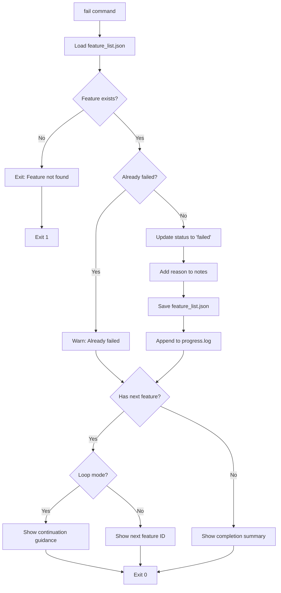
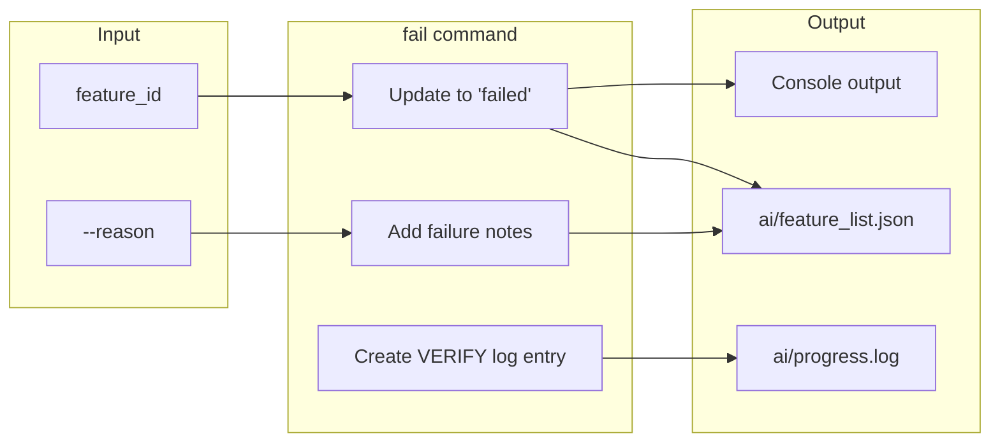

# fail Command

Mark a feature as failed and continue to the next feature in the workflow loop.

## Synopsis

```bash
agent-foreman fail <feature_id> [options]
```

## Description

The `fail` command marks a feature as `failed` status, logs the failure to progress.log, and shows guidance for continuing to the next feature. This enables the unattended loop workflow to continue without stopping when verification fails.

## Arguments

| Argument | Description |
|----------|-------------|
| `feature_id` | The feature ID to mark as failed (required) |

## Options

| Option | Alias | Default | Description |
|--------|-------|---------|-------------|
| `--reason` | `-r` | - | Reason for failure (added to notes) |
| `--no-loop` | - | false | Disable loop continuation guidance |

## Execution Flow



## Data Flow



## Examples

### Basic Usage

```bash
# Mark a feature as failed
agent-foreman fail auth.login
```

### With Reason

```bash
# Mark failed with explanation
agent-foreman fail auth.login --reason "Tests failing: API endpoint not implemented"
```

### Without Loop Guidance

```bash
# Mark failed without continuation prompts
agent-foreman fail auth.login --no-loop
```

## Output Example

```
✗ Marked 'auth.login' as failed
  Reason: Tests failing: API endpoint not implemented

  Next up: auth.logout

══════════════════════════════════════════════════════════════
                   CONTINUE TO NEXT FEATURE
══════════════════════════════════════════════════════════════

   Failed: auth.login
   Status: 5 passing, 1 failed, 3 pending
   Progress: 55%

   NEXT STEPS:
   1. agent-foreman next
   2. Implement feature
   3. agent-foreman check <feature_id>
   4. agent-foreman done <feature_id>

   ➤ Continue NOW. Do NOT stop.
══════════════════════════════════════════════════════════════
```

## Status Transition

```
failing → failed (via fail command)
```

The `failed` status indicates a feature was attempted but could not be completed. This differs from:
- `failing`: Not yet attempted
- `blocked`: Cannot be attempted due to dependencies
- `needs_review`: May need re-verification

## Use Cases

1. **Verification Failure**: When `check` or `done` reports verification failed
2. **Implementation Blocked**: External API not available, missing dependencies
3. **Time Constraints**: Need to move on in unattended mode
4. **Loop Workflow**: Enables AI to continue without stopping

## Related Commands

- [`check`](./check.md) - Verify feature implementation
- [`done`](./done.md) - Mark feature as complete
- [`next`](./next.md) - Get next feature to work on
- [`status`](./status.md) - View all feature statuses
