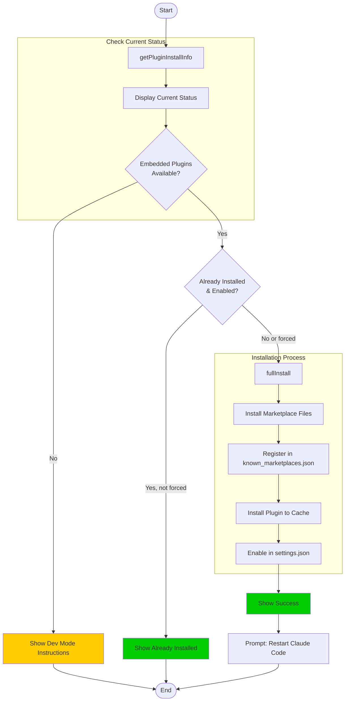
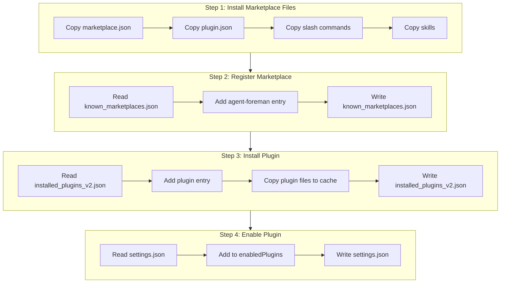
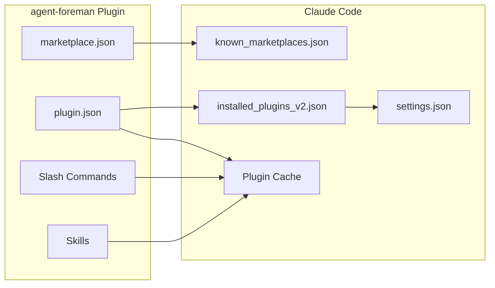
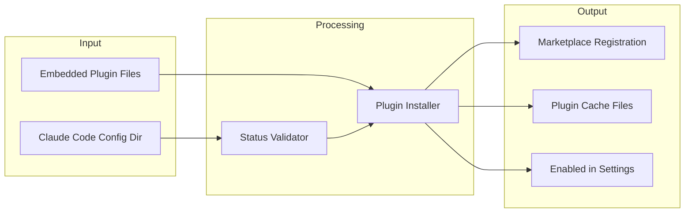

# install Command

Install the agent-foreman Claude Code plugin.

> 安装 agent-foreman Claude Code 插件。

## Synopsis

```bash
agent-foreman install [options]
```

## Description

The `install` command installs and enables the agent-foreman plugin for Claude Code. This plugin provides slash commands and skills that integrate agent-foreman workflows directly into Claude Code.

> `install` 命令安装并启用 Claude Code 的 agent-foreman 插件。此插件提供斜杠命令和技能，将 agent-foreman 工作流直接集成到 Claude Code 中。

## Options

| Option | Alias | Default | Description |
|--------|-------|---------|-------------|
| `--force` | `-f` | `false` | Force reinstall even if already installed |

## Execution Flow



## Installation Steps Detail



## Claude Code Plugin Architecture



## Plugin Components

### Slash Commands

| Command | Description |
|---------|-------------|
| `/agent-foreman:init` | Initialize harness |
| `/agent-foreman:next` | Get next feature |
| `/agent-foreman:status` | View project status |
| `/agent-foreman:analyze` | Analyze project |
| `/agent-foreman:run` | Run tasks |

### Skills

| Skill | Description |
|-------|-------------|
| `init-harness` | Initialize long-task harness |
| `feature-next` | Work on next priority task |
| `feature-run` | Run tasks automatically |
| `project-analyze` | Analyze project structure |

## Data Flow Diagram



## Dependencies

### Internal Modules

- `src/plugin-installer.ts` - Plugin installation logic
  - `fullInstall()` - Complete installation
  - `hasEmbeddedPlugins()` - Check for embedded plugins
  - `getPluginInstallInfo()` - Get installation status

### External Dependencies

- Claude Code installation (for plugin support)

## Files Read

| File | Purpose |
|------|---------|
| `~/.claude-code/known_marketplaces.json` | Existing marketplaces |
| `~/.claude-code/installed_plugins_v2.json` | Existing plugins |
| `~/.claude-code/settings.json` | Current settings |

## Files Written

| File | Purpose |
|------|---------|
| `~/.claude-code/known_marketplaces.json` | Register marketplace |
| `~/.claude-code/installed_plugins_v2.json` | Register plugin |
| `~/.claude-code/settings.json` | Enable plugin |
| `~/.claude-code/cache/plugins/...` | Plugin files |
| `~/.claude-code/marketplaces/...` | Marketplace files |

## Exit Codes

| Code | Meaning |
|------|---------|
| 0 | Success (or already installed) |
| 1 | Installation failed |

## Examples

### Basic Installation

```bash
# Install the plugin
agent-foreman install
```

### Force Reinstall

```bash
# Reinstall even if already installed
agent-foreman install --force
```

## Console Output Example

### New Installation

```
Agent Foreman Plugin Installer
────────────────────────────────────────

Plugin Status:
  Version:     0.1.100
  Marketplace: not registered
  Plugin:      not installed
  Enabled:     no

Installing plugin...

✓ Plugin installed successfully!

Steps completed:
  1. Installed marketplace files
  2. Registered in known_marketplaces.json
  3. Installed plugin to cache
  4. Enabled in settings.json

⚡ Restart Claude Code to use the plugin
```

### Already Installed

```
Agent Foreman Plugin Installer
────────────────────────────────────────

Plugin Status:
  Version:     0.1.100
  Marketplace: ✓ registered
  Plugin:      ✓ installed (0.1.100)
  Enabled:     ✓ yes

✓ Plugin is already installed and enabled
  Use --force to reinstall

To manage the plugin:
  /plugin                    # Browse plugins
  agent-foreman uninstall    # Remove plugin
```

### Development Mode

```
Agent Foreman Plugin Installer
────────────────────────────────────────

Plugin Status:
  Version:     0.1.100
  Marketplace: not registered
  Plugin:      not installed
  Enabled:     no

⚠ Running in development mode (no embedded plugins)
  Plugins are loaded directly from source in development.

To build with embedded plugins:
  npm run build        # Build npm package
  npm run build:bin    # Build standalone binary

Or install from GitHub:
  /plugin marketplace add mylukin/agent-foreman
  /plugin install agent-foreman
```

## Plugin File Structure

```
~/.claude-code/
├── known_marketplaces.json      # Marketplace registry
├── installed_plugins_v2.json    # Plugin registry
├── settings.json                # Plugin enabled here
├── cache/
│   └── plugins/
│       └── agent-foreman/
│           ├── plugin.json
│           ├── commands/
│           │   ├── init.md
│           │   ├── next.md
│           │   └── ...
│           └── skills/
│               ├── init-harness.md
│               └── ...
└── marketplaces/
    └── agent-foreman/
        ├── marketplace.json
        └── plugins/
            └── agent-foreman/
                └── plugin.json
```

## Related Commands

- `agent-foreman uninstall` - Remove the plugin
- `/plugin` - Claude Code plugin browser
