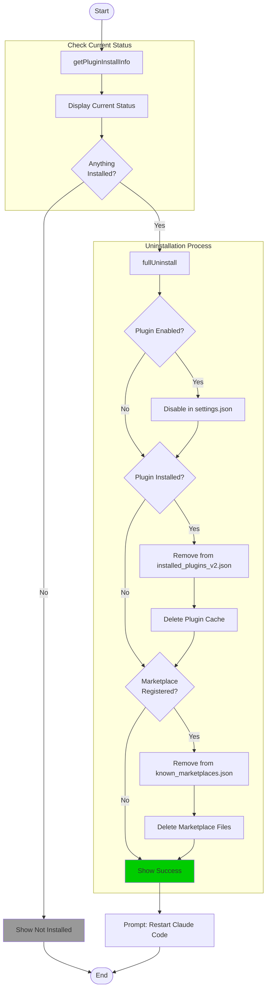
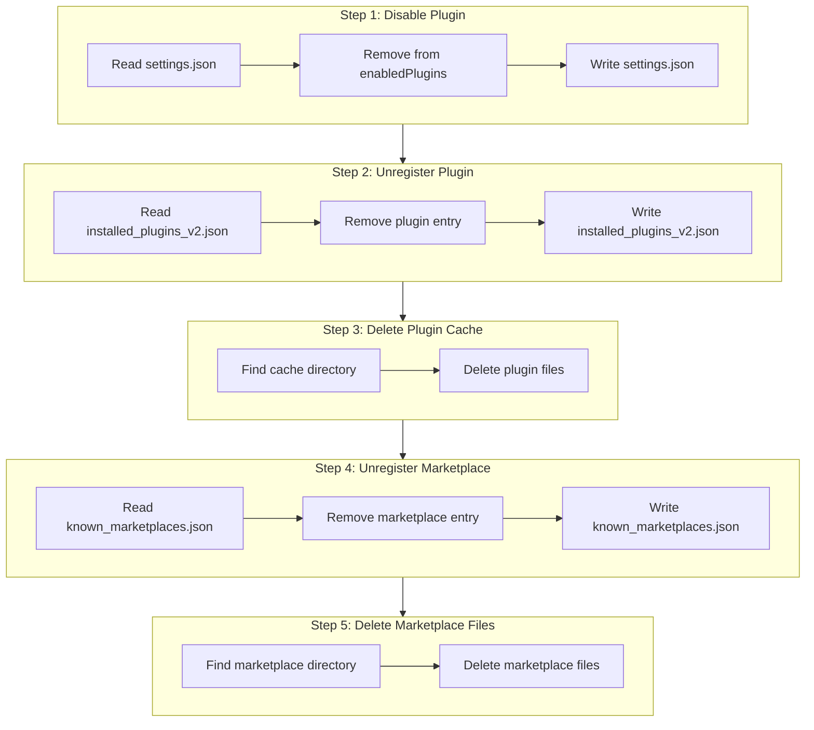
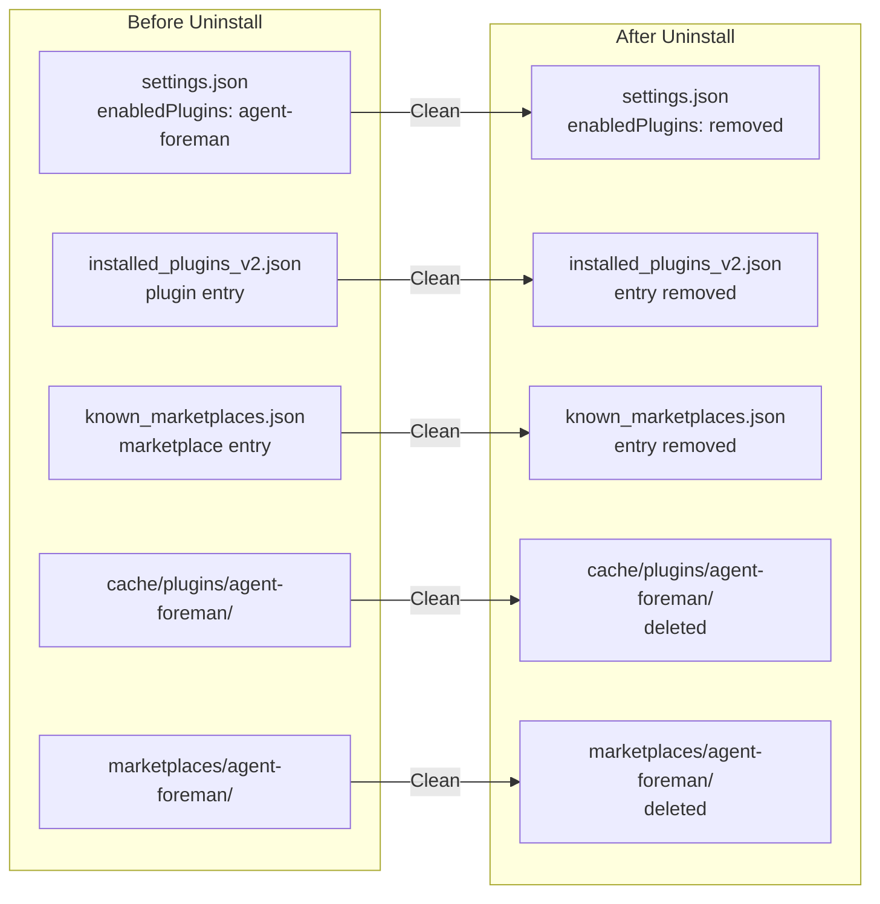
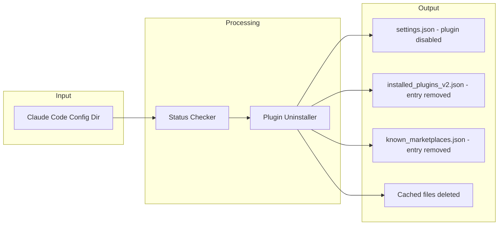

# uninstall Command

Remove the agent-foreman Claude Code plugin.

> 移除 agent-foreman Claude Code 插件。

## Synopsis

```bash
agent-foreman uninstall
```

## Description

The `uninstall` command completely removes the agent-foreman plugin from Claude Code. It disables the plugin, removes registrations, and deletes cached files.

> `uninstall` 命令从 Claude Code 完全移除 agent-foreman 插件。它禁用插件、删除注册信息并删除缓存文件。

## Options

This command has no options.

## Execution Flow



## Uninstallation Steps Detail



## State Cleanup



## Data Flow Diagram



## Dependencies

### Internal Modules

- `src/plugin-installer.ts` - Plugin uninstall logic
  - `fullUninstall()` - Complete uninstallation
  - `getPluginInstallInfo()` - Get installation status

### External Dependencies

- Claude Code installation (for config access)

## Files Read

| File | Purpose |
|------|---------|
| `~/.claude-code/known_marketplaces.json` | Check marketplace registration |
| `~/.claude-code/installed_plugins_v2.json` | Check plugin installation |
| `~/.claude-code/settings.json` | Check if enabled |

## Files Modified/Deleted

| File | Action |
|------|--------|
| `~/.claude-code/settings.json` | Remove from enabledPlugins |
| `~/.claude-code/installed_plugins_v2.json` | Remove plugin entry |
| `~/.claude-code/known_marketplaces.json` | Remove marketplace entry |
| `~/.claude-code/cache/plugins/agent-foreman/` | Delete directory |
| `~/.claude-code/marketplaces/agent-foreman/` | Delete directory |

## Exit Codes

| Code | Meaning |
|------|---------|
| 0 | Success (or nothing to uninstall) |
| 1 | Uninstallation failed |

## Examples

### Basic Uninstall

```bash
# Remove the plugin
agent-foreman uninstall
```

## Console Output Example

### Successful Uninstall

```
Agent Foreman Plugin Uninstaller
────────────────────────────────────────

Current Status:
  Marketplace: ✓ registered
  Plugin:      ✓ installed (0.1.100)
  Enabled:     ✓ yes

Uninstalling plugin...

✓ Plugin uninstalled successfully!

Steps completed:
  • Disabled in settings.json
  • Removed from installed_plugins_v2.json
  • Deleted plugin cache
  • Removed from known_marketplaces.json
  • Deleted marketplace files

⚡ Restart Claude Code to complete removal
```

### Nothing to Uninstall

```
Agent Foreman Plugin Uninstaller
────────────────────────────────────────

Current Status:
  Marketplace: not registered
  Plugin:      not installed
  Enabled:     no

Nothing to uninstall - plugin is not installed.

To install the plugin:
  agent-foreman install
```

### Partial Uninstall

```
Agent Foreman Plugin Uninstaller
────────────────────────────────────────

Current Status:
  Marketplace: ✓ registered
  Plugin:      not installed
  Enabled:     no

Uninstalling plugin...

✓ Plugin uninstalled successfully!

Steps completed:
  • Removed from known_marketplaces.json
  • Deleted marketplace files

⚡ Restart Claude Code to complete removal
```

## Post-Uninstall State

After uninstallation:

1. **Claude Code** will no longer show agent-foreman commands
2. **Slash commands** (`/agent-foreman:*`) will be unavailable
3. **Skills** will be removed from skill list
4. **Plugin files** are deleted from disk

Note: Uninstalling the plugin does NOT affect:
- Project files (`ai/feature_list.json`, etc.)
- The `agent-foreman` CLI itself
- Any work done using the harness

## Reinstallation

To reinstall after uninstalling:

```bash
# Restart Claude Code first
# Then reinstall
agent-foreman install
```

## Related Commands

- `agent-foreman install` - Install the plugin
